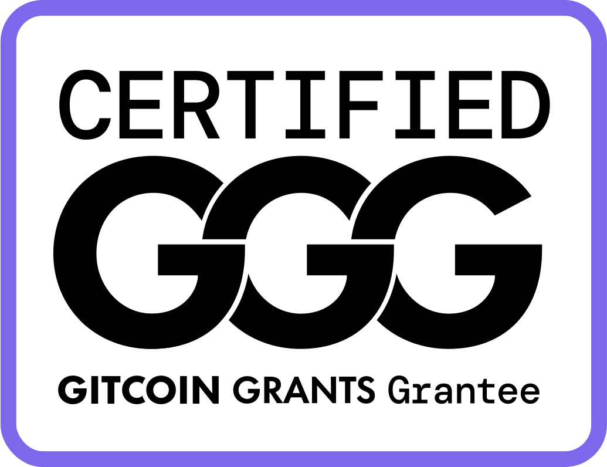
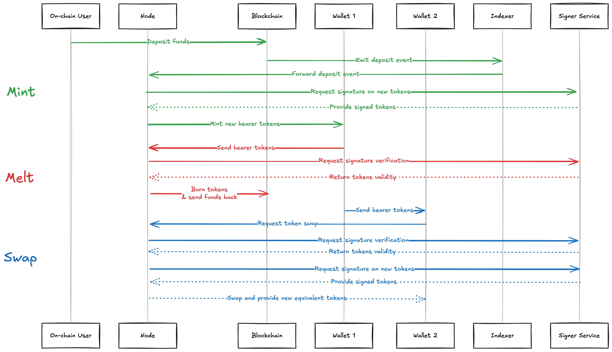

# Paynet

## Unbank the masses

While, in theory, blockchain technologies provided us with the tools to achieve financial sovereignty and security, we must recognise that, in practice, not much as changed for the masses.
Adoption is still minimal and, even among crypto-holders, most keep seing it as "fake internet money", existing in a different world, without any actual impact in their daily life.

We want to solve this in a "user first" approach, providing people and business with a convenient way to pay and be paid in a diversity of crypto assets.
To do so, we are willing accept some trade-off, and to reintroduce one fundamental element in the equation: Trust.

**We believe to be true that <ins>most</ins> people are fine with entrusting <ins>some</ins> amount of money to <ins>some</ins> institution.**

Some people are not, this product is not for them, no hard feelings.

Leveraging trust, we can build a solution that abstract any asset on any chain into a convenient, off-chain and privacy preserving mean of payment for everyday transactions. 

## Roadmap

Read our [Roadmap](./ROADMAP.md) for the next 6 months.

## Partners

<table>
  <tr>
    <td width="100" align="center"></td>
    <td width="800">Blissful recipient of the <a href="https://www.starknet.io/grants/seed-grants/">Starknet Ecosystem Seed Grant</a></td>
  </tr>
  <tr>
    <td width="100" align="center"></td>
    <td width="800">Build with the <a href="https://app.onlydust.com/projects/paynet">OnlyDust community</a>. Pretty sure we have a good issue for you too!</td>
  </tr>
  <tr>
    <td width="100" align="center"></td>
    <td width="800">Proud <a href="https://explorer.gitcoin.co/#/round/42161/865/58">Gitcoin Grantee</a>, thx for all the support 🙏</td>
  </tr>
</table>

## Codebase

This mono-repository contains the whole stack allowing us to provide such a solution, form node to wallet, from smart-contracts to indexer.

### Core architecture design

The whole protocol revolves around users entrusting part of their assets to an actor running a node. This node provides them with bearer tokens for a value equivalent to the amount deposited. 
Thanks to [a little cryptographic signatures scheme](https://gist.github.com/RubenSomsen/be7a4760dd4596d06963d67baf140406), those tokens cannot be traced by the node. The node can only see that the tokens were indeed minted by him, but not identify which one it is. 
Therefore, the node cannot exercise targeted censorship; it is either up for everyone or down for everyone.

### Core operations

*Sequence diagram showcasing how the core operations of the protocol (mint, melt, and swap) are handled.*

### Current development state

This codebase is under active developpement. Any contribution is welcome.

We are currently building a minimalistic prototype, only implementing the most essential features.
Therefore, at the moment we only support one blockchain, [Starknet](https://www.starknet.io/), as our asset provider.

The project takes large inspiration from the [cashu](https://cashu.space/) project and sometime even pieces of code from its [Rust implementation](https://github.com/cashubtc/cdk). 
As a consequence, we are using bitcoin's secp256k1 eliptic curve for our public-key cryptography.

## Try it out

A quick tutorial on how to run the project locally lives in [USAGE.md](./USAGE.md).

## Contributing

We welcome any help. Please look into the open issues and find the one you like.

Helpful informations are available in [CONTRIBUTING.md](./CONTRIBUTING.md).

We are also registered on [OnlyDust](https://app.onlydust.com/projects/paynet/overview).

## Contact

Feel free to DM me on telegram at [@tdelabro](https://t.me/tdelabro).

